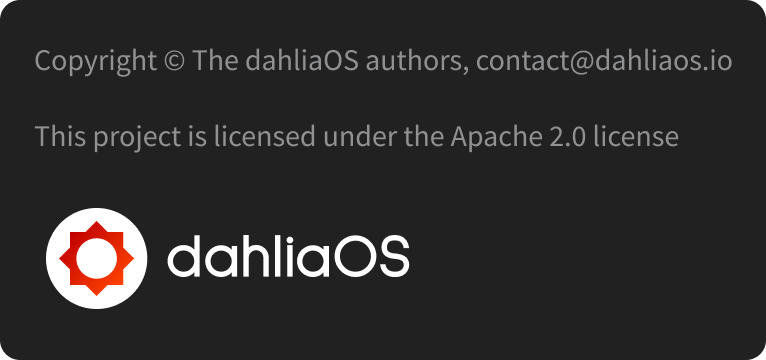

# Documenation

  

Note: this page isn't final yet!

<html>
<head>
<meta name="viewport" content="width=device-width, initial-scale=1">

</head>
<body>

  
  <button class="btn">Learn More</button>

</body>
</html>

## License

  

Copyright © The dahliaOS authors, contact@dahliaos.io

This project is licensed under the [Apache 2.0 license](../LICENSE)